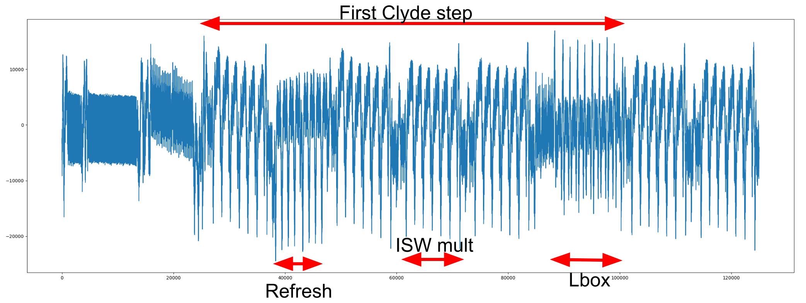

# **Spook Software Capture the Flag (CTF)**
This project contains all the sources for the Software Capture the Flag on a [STM32 F0 Cortex-M0 Discovery board](https://www.st.com/en/evaluation-tools/32f0308discovery.html). This CTF makes available datasets for current measurement on (Spook)[https://spook.dev].

_Note: no security claims come with this code. It is a straightfoward implementation of state-of-the-art software masking scheme of which security depends on various factors such as effective masking order and noise level which are not guaranteed with this code._

## Directory description
This project contains several directories:
*  [embedded_src/](embedded_src): contains Spook authenticated encryption source code. There, [spook_ref/](embedded_src/spook_ref) contains the complete Spook mode of operation while [spook_masked/](embedded_src/spook_masked) contains the masked Clyde implementation.
*  [interface/](interface/): contains Python scripts to interact with the target. The file [spook_masked.py](interface/spook_masked.py) allows to run the masked implementation of Spook. It can be used to retrieve all the intermediates variables within an execution (i.e. for profiled attacks). [parameters.py](interface/parameters.py) contains the parameters of the implementation such as the number of shares.
*  [capture/](capture/): contains the scripts used to generate the datasets.
*  [board_m0/](board/): stores the system files used by the target. It has been mostly generated by [STM32CubeMX](https://www.st.com/en/development-tools/stm32cubemx.html).
*  [test/](test/): contains functional testing scripts.

## Rational for masked implementation
In order to secure Spook against side-channel long term key recovery attacks, only calls to the tweakable blockcipher Clyde have to be protected. Next, we give a few technical details and refer to the code itself for further details.
*   Clyde is bitslice oriented operating on 32-bit words. This makes natural the use of the [Goudarzi and Rivain masking scheme](https://eprint.iacr.org/2016/264.pdf). It is based on [ISW](https://link.springer.com/chapter/10.1007/978-3-540-45146-4_27) multiplication for non-linear operation and SNI refreshing. Linear operations are performed share-wise.
*   Overall, a sharing of a 32-bit word with D shares is an array of D consecutive words in memory. In order to unmask that word, all the D elements of the array are bitwise XORed together. A Clyde state (4 times 32-bit), is then an array of size 4*D.
*   It is expected to be t-probing secure since SNI refreshes have been inserted according to recent tool Tornado.
*   Operations on the shares are implemented in Assembly while control logic is in C language. For readability, the project also contains C functions equivalent to the Assembly ones but are not used for this CTF.
*   Assembly is not tuned for performances but to reduce lower order leakages. As a consequence, these are reduced but still exist.

## Data-sets
For the challenge, various data-sets are available for each number of shares. Namely, 200k traces with random key and random nonce. These are typically used profiling. Five different sets with a fixed key of 100k traces are also available. They can be used for challengers to evaluate their attacks. Evaluation of the submitted attacks will be performed on similar secret traces with fixed secret key. All the data-set are split in multiple files containing each 10k traces.

### Traces description
The avaible traces are raw current traces recorded with a [CT1 current probe](https://download.tek.com/datasheet/AC_Current_Probes.pdf) placed between the power regulator and the target (see [SETUP.md](SETUP.md) for more details). Only the first sbox and lbox layers are recorded within the traces as depicted in the following example (D=4). There, one can observe the first step of Clyde which includes the sbox with 4 ISW multiplications and one refresh. After the sbox layer comes the lbox.


### File format
The traces are stored in a [.npz](https://imageio.readthedocs.io/en/stable/format_npz.html) format with various fields:
*  **traces**: is a int16 matrix where each of the nt rows is a trace corresponding to an encryption. Each file contains nt=10k traces.
*  **nonces**: is a (nt,4) uint32 matrix where each row is the nonce used for the corresponding encryption.
*  **umsk_keys**: is a (nt,4) uint32 matrix  where each row is the secret key.
*  **msk_keys**: is a (nt,4*D) uint32 matrix  where each row is the D sharing of the secret key used. The shares are layout as described above.
*  **seeds**: is a (nt,4) uint32 matrix where each row is a 128-bit word used to seed the prng.
*  **ad**: is the associated data. It is fixed to zero since it has no impact on the first Clyde call.
*  **m**:is the message. It is fixed to zero since it has no impact on the first Clyde call.


Based on this data and [spook_masked.py](interface/spook_masked.py), one can recover the intermediate masked states for each of the traces. As an example, to recover the state after the first lbox layer can be obtained by running
```
msk_state = clyde128_encrypt_masked(nonces.T,np.zeros((4,nt),dtype=np.uint32),msk_key.T,seeds.T,Nr=1,step=0)

```
### Pseudo-Random Number Generation
The randomness used by the masked implementation is generated from the Shadow-512 permutation in sponge mode (see [prng.c](embedded_src/spook_masked/prng.c)). Precisely, a 128-bit seed initializes a Shadow state. Then, this state is updated by running Shadow-512. The 256-bit of capacity are the pseudo random numbers and the state is updated again. This permutation is used since it is already required by Spook.

Practically, the randomness is precomputed and stored in memory. This excludes their generation from recorded traces to reduce their length.

This file and all the figures used are licensed under a [Creative Commons Attribution 4.0 International
License][cc-by].

[![CC BY 4.0][cc-by-image]][cc-by]

[cc-by]: http://creativecommons.org/licenses/by/4.0/
[cc-by-image]: https://i.creativecommons.org/l/by/4.0/88x31.png
[cc-by-shield]: https://img.shields.io/badge/License-CC%20BY%204.0-lightgrey.svg

